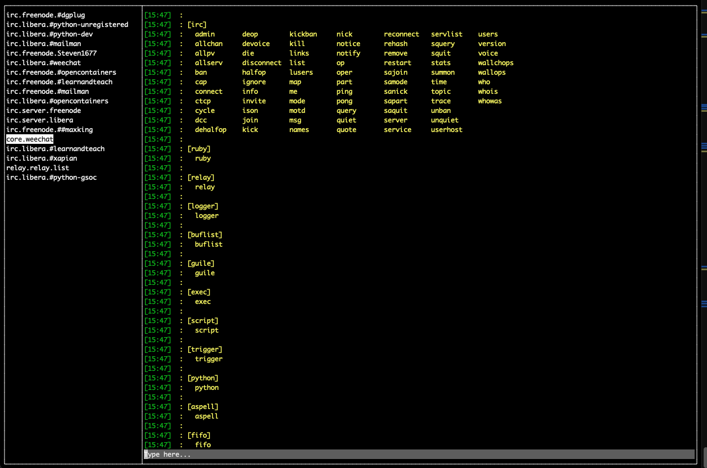

weeclient
==========

Weeclient is a relay client for [Weechat](https://weechat.org).

[](https://pkg.go.dev/github.com/maxking/weeclient) [](https://github.com/maxking/weeclient/actions/workflows/go.yml)


[]

Dependencies
------------

- Golang 1.16


Build
-----

To build the code, you can run:

```bash
$ git checkout https://github.com/maxking/weeclient
$ cd weeclient
$ make
```

Then, you can run with:
```bash
$ ./weeclient
```

KeyBindings
-----------

**Buffer list**

- `Ctrl + b`: Move focus to buffer list.
- `Enter` : When in buffer list, this will move focus to the input box of the buffer.

**Buffer view**

- `Ctrl + s`: Move focus to the chat and allow scrolling up and down
- `Ctrl + i`: Move focus to the input box.

**Input box**
- `Esc`: Clear the box.
- `Enter`: Send the message in the box.


Testing Relay
-------------

This repo comes with a testing CLI that can be used to interact
with the Weechat Relay. Currently, the information printed is really
not that much, but in future, it should be printed better.

```bash
$ ./testclient
```


License
-------
All the contents of this repo are licensed under Apache 2.0 license. 
Please see the LICENSE file included for a full copy of the License.